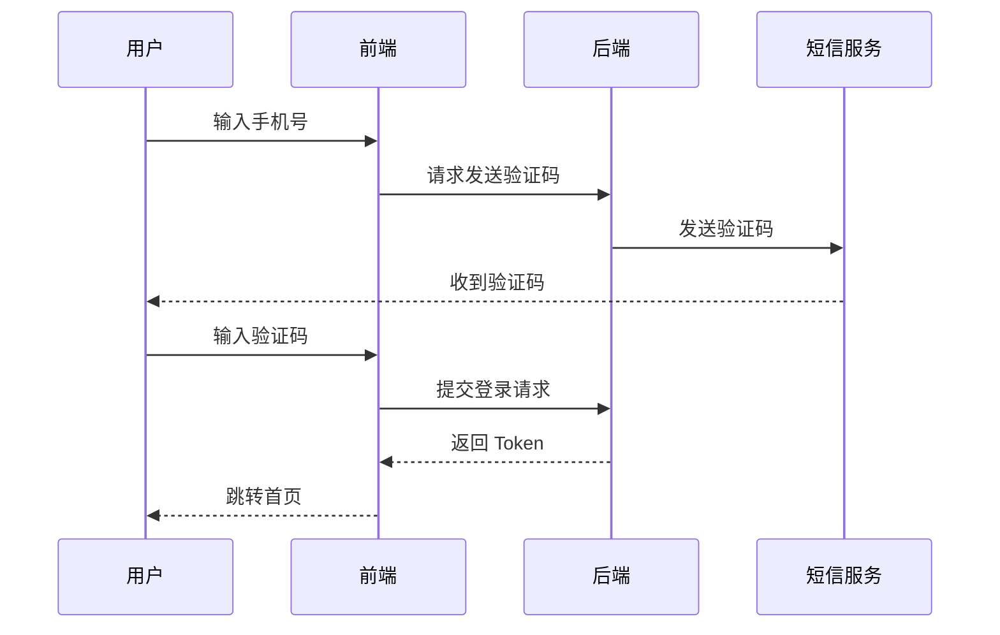
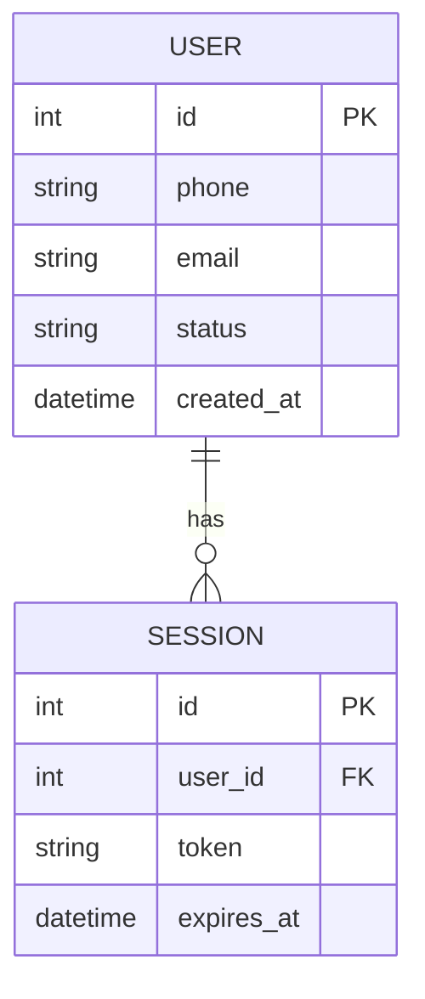

# Mermaid 图表速查

需求文档中凡需可视化，一律使用 Mermaid。

## 常用类型

| 类型 | 典型用途 | Mermaid 形式 |
|------|----------|----------------|
| 模块图 | 功能/子系统/包之间依赖或边界 | `graph TD` / `graph LR` |
| 流程图 | 操作步骤、状态机、业务分支 | `flowchart` |
| 时序图 | 用户、前端、后端、第三方交互顺序 | `sequenceDiagram` |
| 架构图 | 本功能在整体系统中的位置、数据流向 | `flowchart` / `flowchart LR` |
| **ER 图** | **本功能涉及的持久化实体**、字段、关系 | **`erDiagram`** |

## 何时该画图

- 涉及 **两个以上角色或系统交互** → 时序图
- 有 **三步以上流程分支** → 流程图
- 涉及 **新增/变更实体** → ER 图
- **模块间有调用或依赖关系** → 模块图
- 宁可多画几张简洁的图，也不要写大段纯文字描述复杂交互

## 嵌入方式

图内嵌于 Markdown 的 ` ```mermaid ` 代码块中；复杂场景可拆为多张图，每张聚焦一个关注点。

## 示例

### 时序图（登录流程）



### ER 图（用户与会话）


