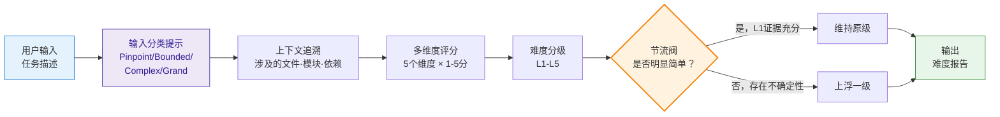

# 任务难度评估

本 Skill 解决一个核心问题：**AI 模型容易低估任务复杂度**。用户给出一句话需求，模型可能直接动手，忽略隐藏的技术债、跨模块耦合、边界条件，导致返工或质量问题。

本 Skill 作为**节流阀（throttle valve）**：在执行前先评估难度，给出分级和上下文分析，防止"看起来简单实则复杂"的任务被草率处理。

## 核心机制



### 输入分类提示

被 orchestrator 调用时，接收输入分类结果作为评分校准参考（不替代评分）：

| 输入分类 | 分数预期范围 | 说明 |
|---------|------------|------|
| Pinpoint | L1-L2 (1-4) | 分类提示为低难度区间，但评分仍可能突破（如目标点涉及复杂依赖链） |
| Bounded | L2-L3 (2-6) | 分类提示为中低区间 |
| Complex | L3-L4 (4-8) | 分类提示为中高区间 |
| Grand | L4-L5 (7-10) | 分类提示为高难度区间 |

如果实际评分与分类提示的预期范围偏差 > 2 级，须在难度报告中标注偏差原因。

## 难度等级

| 等级 | 名称 | 典型特征 | 示例 |
|------|------|---------|------|
| **L1** | 琐碎 | 单文件、无逻辑变更、配置/文案修改 | 修改按钮文字、更新版本号 |
| **L2** | 简单 | 单模块、逻辑清晰、无跨模块影响 | 新增一个工具函数、修复已定位的 Bug |
| **L3** | 中等 | 多文件、涉及 2-3 个模块、需要设计决策 | 新增 CRUD 页面、重构组件 API |
| **L4** | 复杂 | 跨模块联动、架构影响、需要方案评审 | 新增权限系统、接入第三方支付 |
| **L5** | 重大 | 系统级变更、破坏性改动、数据迁移 | 微服务拆分、数据库 Schema 迁移、框架升级 |

## 上浮偏差规则（Throttle）

这是本 skill 的核心差异化机制——**加权分偏置**，而非直接跳级：

1. **偏置上浮**：加权分 +0.5（10 分制下），可能导致跨级也可能不跨级
2. **L1 豁免条件**：仅当以下全部满足时，不施加偏置：
   - 变更范围 ≤ 1 个文件
   - 不涉及业务逻辑
   - 不涉及跨模块导入/导出
   - 无测试覆盖要求
3. **封顶 10 分**：偏置后不超过 10
4. **偏置可被覆盖**：如果上下文分析明确表明无风险（如纯文案修改），可取消偏置，但须在报告中给出原因

## 评估维度

对每个维度打 **1-10 分**，然后取加权平均映射到 L1-L5。

| 维度 | 权重 | 评估内容 |
|------|------|---------|
| **范围 (Scope)** | 30% | 涉及多少文件/模块、变更面积 |
| **深度 (Depth)** | 25% | 技术复杂度、算法难度、架构层级 |
| **耦合 (Coupling)** | 20% | 跨模块依赖、接口变更的连锁影响 |
| **风险 (Risk)** | 15% | 出错的代价、可逆性、数据安全 |
| **认知 (Cognition)** | 10% | 需要的领域知识、隐含的业务规则 |

### 加权分 → 等级映射

| 加权分范围 | 等级 |
|-----------|------|
| 1.0 - 2.0 | L1（琐碎） |
| 2.1 - 4.0 | L2（简单） |
| 4.1 - 6.0 | L3（中等） |
| 6.1 - 8.0 | L4（复杂） |
| 8.1 - 10.0 | L5（重大） |

> 完整评分细则见 → `references/scoring-guide.md`

## 上下文追溯

评分不是凭空打分，必须先追溯任务涉及的上下文：

### 追溯步骤

```
1. 解析输入 → 提取关键实体（模块名、文件名、功能点、技术概念）
2. 探索代码 → 查找相关文件、导入链、依赖关系
3. 识别边界 → 确定变更的直接影响范围和间接影响范围
4. 发现隐患 → 检查测试覆盖、类型安全、错误处理等
```

### 上下文来源

- 项目文件结构（目录树、文件分类）
- 代码依赖关系（import/export 链）
- 配置文件（package.json、tsconfig 等）
- 已有测试覆盖
- Git 历史（该区域的变更频率）

> 注意：本 skill 独立工作时，自行读取项目文件获取上下文。

## 输入输出

### 输入

一段任务描述文本。可以是：
- 用户的自然语言需求（"帮我加个登录功能"）
- Bug 报告（"点击提交按钮后页面白屏"）
- 重构请求（"把这个组件拆成三个"）
- 技术任务（"升级到 Vue 3.5"）

### 输出：难度报告

```markdown
# 难度评估报告

## 基本信息

- **任务**: {一句话描述}
- **原始评级**: L{n}
- **最终评级**: L{m} {上浮说明或保持原因}

## 评分明细

| 维度 | 分数(1-5) | 依据 |
|------|----------|------|
| 范围 | {n} | {简要说明} |
| 深度 | {n} | {简要说明} |
| 耦合 | {n} | {简要说明} |
| 风险 | {n} | {简要说明} |
| 认知 | {n} | {简要说明} |
| **加权** | **{avg}** | |

## 上下文分析

### 涉及范围
- 直接影响：{文件/模块列表}
- 间接影响：{可能受连锁影响的部分}

### 关键风险点
- {风险1}
- {风险2}

## 执行建议

{根据难度等级给出的执行策略建议}
```

## Python 脚本

```bash
python scripts/difficulty_scorer.py assess --input <任务描述文本> [--root <project_root>] [--format json|markdown]
```

- `--root`：提供项目路径时，会自动追溯代码上下文辅助评分
- `--format`：默认 `markdown`，`json` 格式便于程序消费

> 脚本实现见 → `scripts/difficulty_scorer.py`
